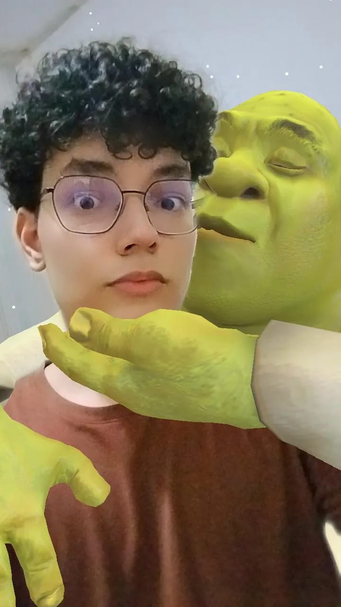

# JavaPets-eCommerce

## Resumo do projeto
Este projeto foi desenvolvido como trabalho da disciplina de programação da Universidade Estadual do Tocantins - UNITINS. O objetivo era criar um eCommerce para cães e gatos, chamado JavaPets.

O projeto foi desenvolvido utilizando a linguagem Java, o framework Quarkus e Angular. Os conceitos do paradigma orientado a objetos também foram aplicados.

## 📝 UML

## ✔️ Técnicas e tecnologias utilizadas

- ``Java 17``
- ``Visual Studio Code``
- ``Quarkus framework``
- ``Angular framework``
- ``Programação Orientada a Objetos``

## 👨‍💻 Autores

## ‍ Autores

| Emannuel Oliveira |  Erick Santos |  Matheus Uchoa|
| :---: | :---: | :---: |

## 📁 Acesso ao projeto
Você pode acessar os arquivos da parte do back-end clicando [aqui](https://github.com/emannuelop/JavaPets-eCommerce/tree/main/back-end).

Você pode acessar os arquivos da parte do front-end clicando [aqui](https://github.com/emannuelop/JavaPets-eCommerce/tree/main/front-end).

